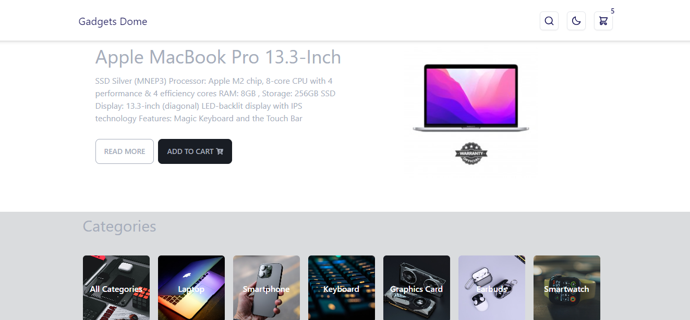

<a name="readme-top"></a>

<!-- PROJECT LOGO -->
<br />
<div align="center">
  <a href="https://github.com/azacdev/gadgets-dome">
    
  </a>

<h3 align="center">Gadgets Dome</h3>

  <p align="center">
    Project_Description
    <br />
    <a href="https://github.com/azacdev/gadgets-dome"><strong>Explore the docs »</strong></a>
    <br />
    <br />
    <a href="https://github.com/azacdev/gadgets-dome">View Demo</a>
    ·
    <a href="https://github.com/azacdev/gadgets-dome/issues">Report Bug</a>
    ·
    <a href="https://github.com/azacdev/gadgets-dome/issues">Request Feature</a>
  </p>
</div>

<!-- TABLE OF CONTENTS -->
<details>
  <summary>Table of Contents</summary>
  <ol>
    <li>
      <a href="#about-the-project">About The Projec</a>
      <ul>
        <li><a href="#built-with">Built With</a></li>
      </ul>
    </li>
    <li>
      <a href="#getting-started">Getting Started</a>
      <ul>
        <li><a href="#prerequisites">Prerequisites</a></li>
        <li><a href="#installation">Installation</a></li>
      </ul>
    </li>
    <li><a href="#usage">Usage</a></li>
    <li><a href="#contributing">Contributing</a></li>
    <li><a href="#license">License</a></li>
  </ol>
</details>

<!-- ABOUT THE PROJECT -->
## About The Project



An e-commerce site that offers a variety of gadgets such as laptops, smartphones, graphics cards, and keyboards.

<p align="right">(<a href="#readme-top">back to top</a>)</p>

### Built With

- React
- Context API
- Axios
- React Router
- Tailwind CSS
- Daisy UI

<p align="right">(<a href="#readme-top">back to top</a>)</p>

<!-- GETTING STARTED -->
## Getting Started

### Prerequisites

* npm
  ```sh
  npm install createvite@latest -g
  ```
### Installation

1. Clone the repo
   ```sh
   git clone https://github.com/azacedev/gadgets-dome.git
   ```
2. Install NPM packages
   ```sh
   npm install
   ```

<p align="right">(<a href="#readme-top">back to top</a>)</p>

## Features

- Browse gadgets category and fiter category by type.
- Search for specific gadgets using the search functionality.
- Click on add to cart button to add item to carts and navigate to cart page to see your total items with total price
- Light / DarkMode
- View detailed information about each gadgets, name, price, brand, rating and more.

Usage
On the home page, you can browse through the list of gadgets or filter the gadgets according to their category.
Use the search functionality in the header to find specific gadget.
Click on an gadgets card to view detailed information about that gadget.

<!-- CONTRIBUTING -->
## Contributing

Contributions are what make the open source community such an amazing place to learn, inspire, and create. Any contributions you make are **greatly appreciated**.

If you have a suggestion that would make this better, please fork the repo and create a pull request. You can also simply open an issue with the tag "enhancement".
Don't forget to give the project a star! Thanks again!

1. Fork the Project
2. Create your Feature Branch (`git checkout -b feature/AmazingFeature`)
3. Commit your Changes (`git commit -m 'Add some AmazingFeature'`)
4. Push to the Branch (`git push origin feature/AmazingFeature`)
5. Open a Pull Request

<p align="right">(<a href="#readme-top">back to top</a>)</p>

<!-- LICENSE -->
## License

Distributed under the MIT License. See `LICENSE.txt` for more information.

<p align="right">(<a href="#readme-top">back to top</a>)</p>
